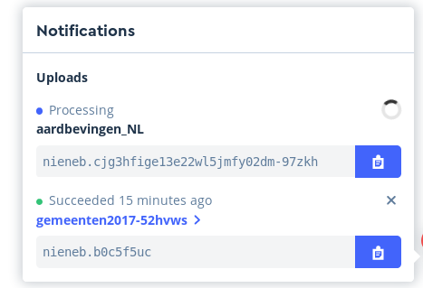
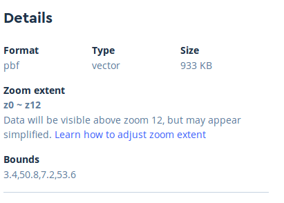
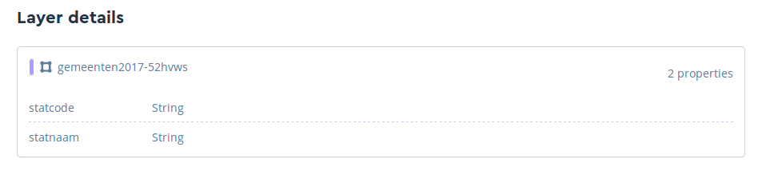
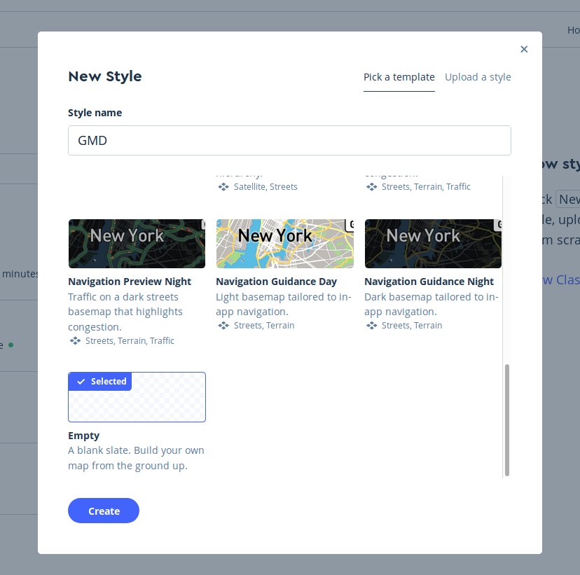
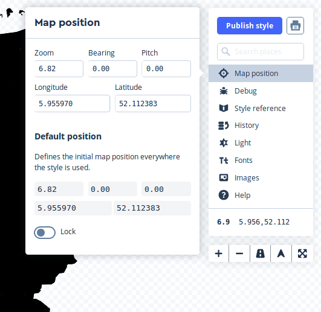
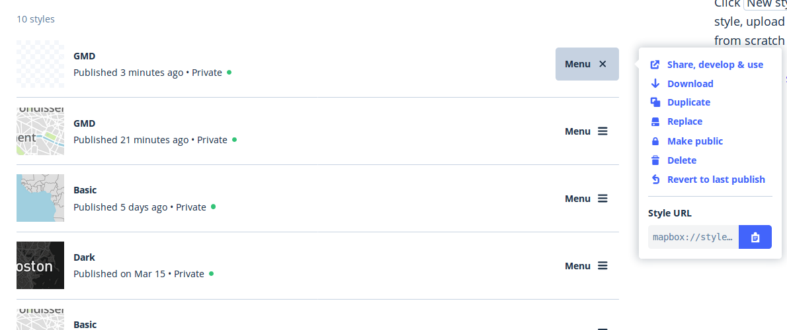
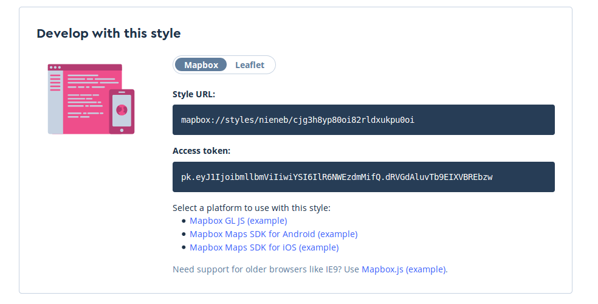

# Mapbox studio

[Mapbox Studio](https://www.mapbox.com/mapbox-studio/) is a good place to start making beautiful cartographic visualisations! 
You can start using Mapbox Studio for free. But Mapbox Studio is not open source. When hosting a lot of your data on their services or using their service for commercial goals Mapbox has a pricing plan. 

:link: A open source alternative to Mapbox Studio is [Maputnik](https://maputnik.github.io/).

Let's start with Mapbox Studio. Just for 10 minutes.

:arrow_forward: Go to  [https://www.mapbox.com/studio/](https://www.mapbox.com/studio/) and make yourself a Mapbox account.

Now you have yourself a Mapbox Access Token. 

:link: Need help?  [https://www.mapbox.com/help/studio-manual/](https://www.mapbox.com/help/studio-manual/)

## Datasets & Tilesets
We will start with uploading our own data.

:arrow_forward:Go to `Tilesets` and add the `gemeenten2017.geojson` data from the workshop materials. 

Mapbox Studio will now create your vector tile set from the GeoJSON. This can take a few minutes. It will show a pop-up when it is done. 

:arrow_forward: When loaded, click on the `gemeenten` set.  

You will see a overview of the dataset we just created:

The details show the attributes available in your tileset. 

> #### Datasets vs. tilesets
> Datasets and tilesets are two different types of files that you can create when uploading data to your Mapbox account.
> Datasets provide access to feature geometries (points, lines, and polygons) and properties (attributes), both of which can be edited in the Mapbox Studio dataset editor or through the Mapbox Datasets API.
> Tilesets are lightweight collections of vector data that are optimized for rendering and are not editable but can be styled in the Mapbox Studio style editor.

## Style

Let's style our data. 

:arrow_forward: Go to `Styles` and create a new style. Start with a blank one or a already existing one. 

Mapbox Studio provides you with a few ready to go styles to get you started. The data behind this is Open Street Map data.  

I choose an empty style:

:arrow_forward: Add your Tilesets to the map.

Note, the geometries of the municipalities are polygons. Give them some color too. 

:arrow_forward: Change the map view to the Netherlands. 

:arrow_forward: Spend some minutes on creating a nice style.

You can add some OSM layers, labels. Just explore the possibilities of Mapbox Studio. 

## Terms

A *Tileset* is the same as *Vector Tile* source. Here we created a Vector Tile set with just 1 data layer. Later we will use Vector Tile Sets which contain multiple layers, like roads, landuse, water. These *Data Layers* in the Vector Tiles contain geometries and attributes.  
A *Style Layer* is a layer that is visualized on your map. We can style data layers multiple times. So one Data Layer can create multiple Style Layers. Like road_fill, road 

## Publish! Share Develop use

When you finish your style we can move on to the next step, to actually publish your map! 

:arrow_forward: Go to the `Styles` tab and then click on the `Menu` of the style you want to publish. 

:arrow_forward: Click on  > `Share, develop & use` . 

Here are all the options to publish and develop your map further. 

The section `Share` gives you a url with a full working map. All hosted by Mapbox. 

:arrow_forward: Open the Share Url in your browser. 

My map url:

    https://api.mapbox.com/styles/v1/nieneb/cjg3h8yp80oi82rldxukpu0oi.html?fresh=true&title=true&access_token=<AccesToken>#7.5/52.885332/6.282427/2

At the section `Develop with this style`  there are lines of code which we will be using in the next step [[MapboxGL js part 1]]with the Mapbox-GL.js library.

:arrow_forward: So leave this page open for reference in the next steps. 

:arrow_right: Let's go to step 1 to set-up our own web map in [[MapboxGL js part 1]]! 
