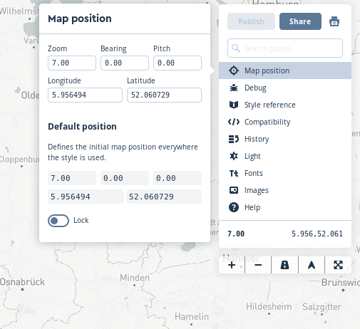
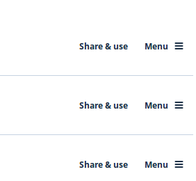
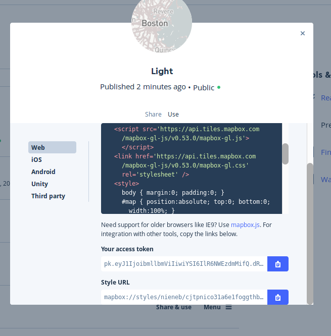

# Mapbox studio

[Mapbox Studio](https://www.mapbox.com/mapbox-studio/) is a good place to start making beautiful cartographic visualisations! 

You can start using Mapbox Studio for free. But Mapbox Studio is not open source. When hosting a lot of your data on their services or using their service for commercial goals Mapbox has a pricing plan. 

:link: A open source alternative to Mapbox Studio is [Maputnik](https://maputnik.github.io/).

Let's start with Mapbox Studio. Just for 10 minutes.

:arrow_forward: Go to  [https://www.mapbox.com/studio/](https://www.mapbox.com/studio/) and make yourself a Mapbox account.

Now you have yourself a Mapbox Access Token. 

:link: Need help?  [https://www.mapbox.com/help/studio-manual/](https://www.mapbox.com/help/studio-manual/)

## Styling

We will start with re-styling one of Mapbox maps. Mapbox already has the vector tile sources available and some general styles for you to start from.The data behind this is Open Street Map data.   

:arrow_forward:Go to `Styles` and click on `New Style`

:arrow_forward: Choose one of the already existing styles. 

:arrow_forward: Follow the walk through that Mapbox Studio offers.

On the right you see the general settings of your map. 

Have a look at the values in the `Map position`

:arrow_forward: Change the map view to the Netherlands by using the search options on the right of the screen. 

:arrow_forward: Now lock the position of the map. This will make sure your map will be opened at this location.

If you look at `Style reference` you will find an overview of the tile sources used and the data layers available. 

Under `font` and `images` you find which fonts and icon images are available from Mapbox. 

On the left you see the layers in the map wich are added and styled. The icon shows if you are styling a polygon, line, point or label. Here you can change the style per layer or per layer group. 

:arrow_forward: Spend some minutes on changing the style to your design.

## Terms

A *Tileset* is the same as *Vector Tile* source. This Vector Tile set can contain multiple layers, like roads, landuse, water. These *Data Layers* in the Vector Tiles contain geometries and attributes.  
A *Style Layer* is a layer that is visualized on your map. We can style data layers multiple times. So one Data Layer can create multiple Style Layers. Like road_fill, road. Or we can simply not style a layer then it won't be visible.

## Publish! Share & use

When you finish your style we can move on to the next step, to actually publish your map! 

:arrow_forward: Go to the `Styles` tab and then click on the `Share & use` of the style you want to publish. 

:arrow_forward: Click on  > `Share & use` . 

Here we have 2 options to publish and develop your map further. 

The section `Share` gives you a url with a full working map. All hosted by Mapbox. 

:arrow_forward: Open the Share Url in your browser. 

My map url:

`https://api.mapbox.com/styles/v1/nieneb/cjg3h8yp80oi82rldxukpu0oi.html?fresh=true&title=true&access_token=<AccesToken>`

At the section `Use` there are 2 lines of code which we will be using in the next step when we set up our own map with the Mapbox-GL.js library.

* Your Access token
* Style Url

:arrow_forward: Leave this page open for the 2 url references that we need in the next step. 

:arrow_right: Let's go to step 1 to set-up our own web map in [[MapboxGL js part 1]]! 
