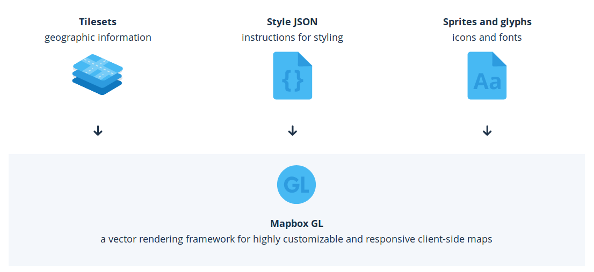

# Making a map with HTML and JavaScript

We will start with the most basic form of using MapboxGL.js using their already provided styles. In order to use the default styles and data we need a Mapbox token. Later on we will use MapboxGL.js without this token, because we will use our own data and styles! 


:link: If you are not that comfortable with HTML, CSS and JavaScript yet, this [Making a Web page](https://github.com/NieneB/Webmapping_for_beginners/wiki/Making-a-web-page) tutorial will help you along!

:arrow_right: If you already know some HTML, CSS and JavaScript, you can start immediately with this tutorial and read through the HTML explanations. 

:arrow_right: Feel real confident? Just skip [Setting up the basics](#setting-up-the-basics) and go to [Setting up mapboxGL.js](#setting-up-mapboxgl.js)

## Setting up the basics 

### HTML 

:arrow_forward: Open your text editor.

:arrow_forward: Create an empty file to make your basic HTML page. Copy the following into your file:

``` html
<!DOCTYPE html>
  <html>
    <head>
      <title> My title </title>
    </head>
  <body>
    <H1>Example</H1>
  </body>
</html>
```

:arrow_forward: Save the file in :open_file_folder:`yourDirectory` and call the file `index.html`.

:arrow_forward: Change the title to “My first MapoxGL map".

:arrow_forward: Place a `<div>` in the `<body>` 


``` html
<div id="map"></div>
```

The `<div>` is a kind of frame where our map will come! This frame does not contain anything yet. We will have to give it some dimensions in order to show content. We will specify the width and height with CSS, so the `<div>` can be seen. Later, we will give content to the `<div>` with JavaScript. To be able to do that, we will need its **id** to be able to reference it.

### CSS 

:arrow_forward: Open a new file and save this as `main.css` in :open_file_folder:`yourDirectory`.

With CSS we will style our `<div>` object. In the `main.css` we will reference to the `<div>` with a "#map" selector which indicates a object with the `id="map"` in the HTML. Now set the rule height(and optional width). 

:arrow_forward: Copy this into your CSS file:

``` css
#map { 
  height: 500px; 
  width:100%;
} 
```

:arrow_forward: Change the amount of pixels and/or percentage to the map size you prefer.

To link our CSS file with our HTML objects we will have to put a link in our HTML file. 

:arrow_forward: Go back to your index.html file and put the link to your CSS file in the `<head>`.


``` html
<link rel="stylesheet" href="main.css"/>
```

### JavaScript Libraries

Now we will add the JavaScrip Library MapboxGL.js.

:arrow_forward: Go to https://www.mapbox.com/mapbox-gl-js/api/.

:arrow_forward: Scroll down and copy the link of the newest MapboxGL library release:


``` html
<script src='https://api.tiles.mapbox.com/mapbox-gl-js/v0.45.0/mapbox-gl.js'></script>
<link href='https://api.tiles.mapbox.com/mapbox-gl-js/v0.45.0/mapbox-gl.css' rel='stylesheet' />
```

:arrow_forward: Include the JavaScript and CSS files in the `<head>` of your HTML file.

### JavaScript 

The last thing we need is add is a JavaScript file for our own custom JavaScript. 

:arrow_forward: Make a new file and save the file in :open_file_folder:`yourDirectory`
 and call the file `main.js`.

:arrow_forward: Now include the `<script>` in the `<body>` of your HTML file. 

Your HTML file should look like this:

``` html
<!doctype html>
<html>
  <head>
    <title>My first MapboxGL map</title>  
    <script src='https://api.tiles.mapbox.com/mapbox-gl-js/v0.45.0/mapbox-gl.js'></script>
    <link href='https://api.tiles.mapbox.com/mapbox-gl-js/v0.45.0/mapbox-gl.css' rel='stylesheet'/>
    <link rel="stylesheet" href="main.css"/>
  </head>
  <body>
    <H1>example</H1>
    <div id="map"></div>
    <script src="main.js"></script>
  </body>
</html>
```

:arrow_forward: Now open the HTML file in your browser.

You will only see a title. This is correct. We still have to set up our map. 

## Setting up MapboxGL.js

In the JavaScript file we need to define our map. 

```js
mapboxgl.accessToken = '<YourAccess token>';

var map = new mapboxgl.Map({
    container: 'map',
    style: 'mapbox://styles/mapbox/streets-v9',
    hash: true,
    zoom: 11,
    pitch: 60,
    bearing: 62.4,
    center: [ 4.8, 52.4]
});
```

:arrow_forward: Copy this code into your `main.js` file and save it. 

:arrow_forward: Use your own Mapbox Access token. You can find this when you log in to your own Mapbox account. 

:information_source: `new mapboxgl.Map({...});` creates a mapbox GL map! 

:information_source: `container: "map"` places the map in our `<div id="map">` object from the HTML file. 

:information_source: `style: 'mapbox://styles/mapbox/streets-v9'` is the mapbox url for the tiles, style, fonts and Glyphs! . 


A default Mapbox style contains all the elements we need for a map:

- Vector Tiles
- Styling information
- Fonts, Sprites and Glyphs



:information_source: `hash: true` puts the #location in the URL of our map. With `/zoom/lat/long/angle`. See what happens to the URL of your map when you pan around. 

:information_source: `zoom`,`pitch` , `bearing` and `center` set the starting position of our map when opening it the first time. Now pointing to Amsterdam. 


:arrow_forward: Refresh the file in your browser and you will see your map!

Something like this:


## Use your Mapbox studio hosted style!

In step 1 [[Mapbox Studio]] we created our own styled map. We can also use this instead of the standard supplied Mapbox styles. 

:arrow_forward: Replace the style url with your own style url. 

You can find this url on your Mapbox account under `Share, develop & use` . 


```js
 mapboxgl.accessToken = '<YourAccess token>';
    var map = new mapboxgl.Map({
        container: 'map-container',
        style: 'mapbox://styles/nieneb/cjg3h8yp80oi82rldxukpu0oi',
        hash: true,
        zoom: 11,
        pitch: 60,
        bearing: 62.4,
        center: [ 4.8, 52.4]
    });
```

:arrow_forward: Refresh your browser and see your own Mapbox Studio Map! 


### Problems?

Use the Web Console. 

:arrow_forward: In your browser when you opened your HTML page click with your right mouse button, choose : Inspect Element 

:arrow_forward: Or Press F12

The `web inspector` shows you the content of your page and the current state of the DOM. DOM stands for Document Object Model and refers to the hierarchical structure of HTML. Web browsers parse the DOM in order to make sense of a page’s content.

:arrow_forward: Go to the `Inspector`, Do you see the same content as we just made in our text editor?

:arrow_forward: Just have a look around. Nothing can happen!

The `Console` logs any errors or comments! 

:arrow_forward: Go to the tab `Web Console` to see if it reports anything useful for you.

Fix your problems! 


:arrow_right: Next Setting up our own style with [[MapboxGL js part 2]]